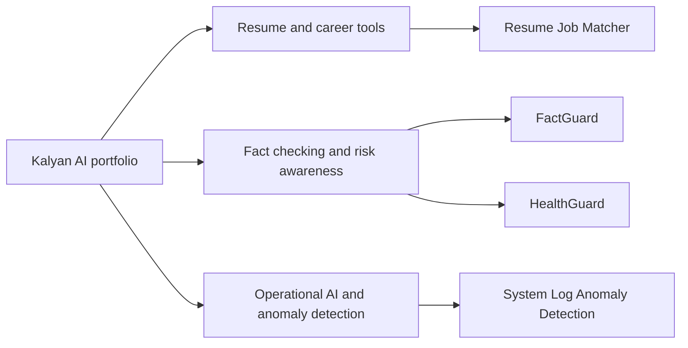

# Kalyan AI Portfolio

<strong>A curated index of Kalyan's AI and application projects.</strong>

## Project map

| Project | Repository | Focus |
| --- | --- | --- |
| Resume + Job Matcher | [AI-Resume-Job-Matcher-System](https://github.com/kalyan870/AI-Resume-Job-Matcher-System) | Browser-based resume and role comparison prototype |
| FactGuard | [FactGuard-AI-Assisted-Claim-Verification](https://github.com/kalyan870/FactGuard-AI-Assisted-Claim-Verification) | Claim verification project concept |
| HealthGuard | [HealthGuard-Health-Risk-Awareness-System](https://github.com/kalyan870/HealthGuard-Health-Risk-Awareness-System) | Health-risk awareness project concept |
| System Log Anomaly Detection | [ai-system-log-anomaly-detection](https://github.com/kalyan870/ai-system-log-anomaly-detection) | Log monitoring project concept |

## About this repository

This repository is an index, not a separate application: it currently contains no portfolio website source or runnable application. Follow the linked project repositories for their individual implementation status and setup instructions.
